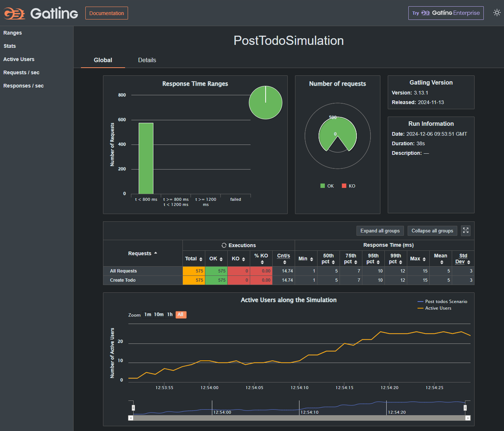

# Test Todo Project

## Overview

Welcome to the Test Todo Project! Here’s a quick overview of the technologies used in this project:

- Kotlin: 2.0.10
- Java: 21
- Spring Framework: 3.4.0
- JUnit: 5.11.3
- RestAssured: 5.5.0
- Allure: 2.29.0
- Gradle: 8.10.2

## Setup and Deployment

To run the application locally, follow these steps:

1. Load the Docker image:
   ```bash
   docker load < todo-app.tar
2. Run the container using the following command:
   ```bash
   docker run -p 8080:4242 -e VERBOSE=1 todo-app:latest

## Project Configuration
This project leverages Spring Boot for dependency injection, which simplifies working with classes. I selected java bean configuration with manual bean creation for greater flexibility, allowing us to easily intervene in the lifecycle if needed. With Spring profiles, switching between environments is straightforward, allowing for specific logic adjustments per environment if necessary.

Configuration properties enable safe storage of sensitive data like credentials. In this project, they are stored openly, but it's recommended to use a vault for protection. Integrating Spring Cloud Config allows changing config variables in real-time without restarting the application.

## Testing
### Overview
The project uses SpringBootTest annotation in test classes. Since these classes aren't Spring entities, we use constructor-based property binding for optimal code readability and maintenance.

### Allure Integration
Allure is integrated into the project, featuring:

Tests categorized by responsibility.
Nested steps in the test reports for enhanced readability.
Logging of requests, responses, and assertions as separate steps for better debugging.

1. To run the tests and generate the Allure report, use:
   ```bash
   gradle clean test allureServe


### Load Testing
A performance testing scenario for the POST endpoint is written using Gatling. Load is applied smoothly to avoid immediate stress, allowing the application to properly "warm up."

1. You can execute load tests using:
   ```bash
   gradle gatlingRun
After which, the report will be available in build/reports/gatling.

